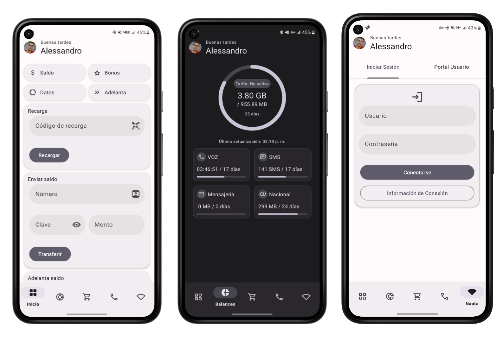

    <!-- Screenshots App-->
    

<!-- Plataform -->

<!-- Api-->
 
<!-- License -->

 

### En que se diferencia 
Es ligera, útil y moderna, además de estar en constante desarrollo es una de las primeras aplicaciones en tener soporte para Material You en Cuba.

### Funciones:

- [x] Recargar saldo principal con cupones.
- [x] Consultar sus saldo, datos y bonos.
- [x] Guardar el estado de sus balances [Android 8+]
- [x] Comprar Planes y Paquetes.
- [x] Llamar con *99 o número privado.
- [ ] Conectarse a redes WIFI públicas y acceder al portal nauta.
- [ ] Borrar correos nauta del servidor.
- [x] Actualización periódica de sus Balances.
- [ ] Widgets en pantalla.
- [ ] Realizar conexión a las wifi desde la barra de acción.
- [x] Bloqueo por huella o facial.
- [x] Apartado de Perfil.

### Agradecimientos:

- [@lesclaz](https://t.me/lesclaz) por crear [suitetecsa](https://github.com/suitetecsa/)
- [@roclahy](https://twitter.com/roclahy) por el apoyo incondicional.

### License
========
This is the source code of an Android application that helps manage 
the mobile services of the Cuban Telecommunications Company. (ETECSA).

    Copyright (C) 2023  Applify

    This program is free software: you can redistribute it and/or modify
    it under the terms of the GNU General Public License as published by
    the Free Software Foundation, either version 3 of the License, or
    (at your option) any later version.

    This program is distributed in the hope that it will be useful,
    but WITHOUT ANY WARRANTY; without even the implied warranty of
    MERCHANTABILITY or FITNESS FOR A PARTICULAR PURPOSE.  See the
    GNU General Public License for more details.

    You should have received a copy of the GNU General Public License
    along with this program.  If not, see <https://www.gnu.org/licenses/>.

Also add information on how to contact you by electronic and paper mail.

  If the program does terminal interaction, make it output a short
notice like this when it starts in an interactive mode:

    SIMple  Copyright (C) 2023  Applify
    This program comes with ABSOLUTELY NO WARRANTY; for details type `show w'.
    This is free software, and you are welcome to redistribute it
    under certain conditions; type `show c' for details.

The hypothetical commands `show w' and `show c' should show the appropriate
parts of the General Public License.  Of course, your program's commands
might be different; for a GUI interface, you would use an "about box".

  You should also get your employer (if you work as a programmer) or school,
if any, to sign a "copyright disclaimer" for the program, if necessary.
For more information on this, and how to apply and follow the GNU GPL, see
<https://www.gnu.org/licenses/>.

  The GNU General Public License does not permit incorporating your program
into proprietary programs.  If your program is a subroutine library, you
may consider it more useful to permit linking proprietary applications with
the library.  If this is what you want to do, use the GNU Lesser General
Public License instead of this License.  But first, please read
<https://www.gnu.org/licenses/why-not-lgpl.html>.